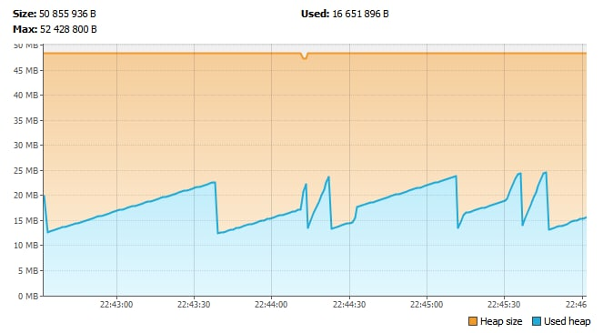

This project is done as a proof-of-concept of streaming zip archives (without creating zip file on a server, hence avoiding excessive memory/disk space consumption) via jetty server (actualy, implementaion is web-server agnostic)

After starting web-server with Main run configuration, GET request to localhost:8080/api/download endpoint will return a 1GB zip file without OOM despite explicit -Xmx50m VM option, limiting max heap size to 50MB.

Actual memory consumption is even less:
